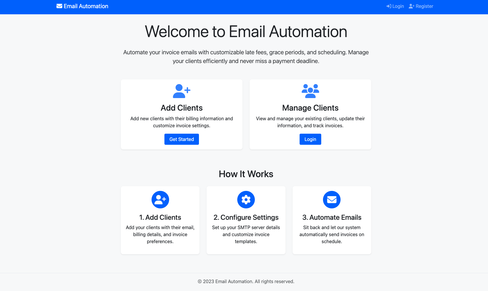
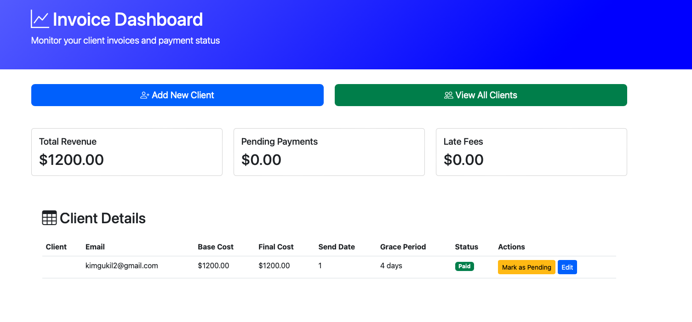
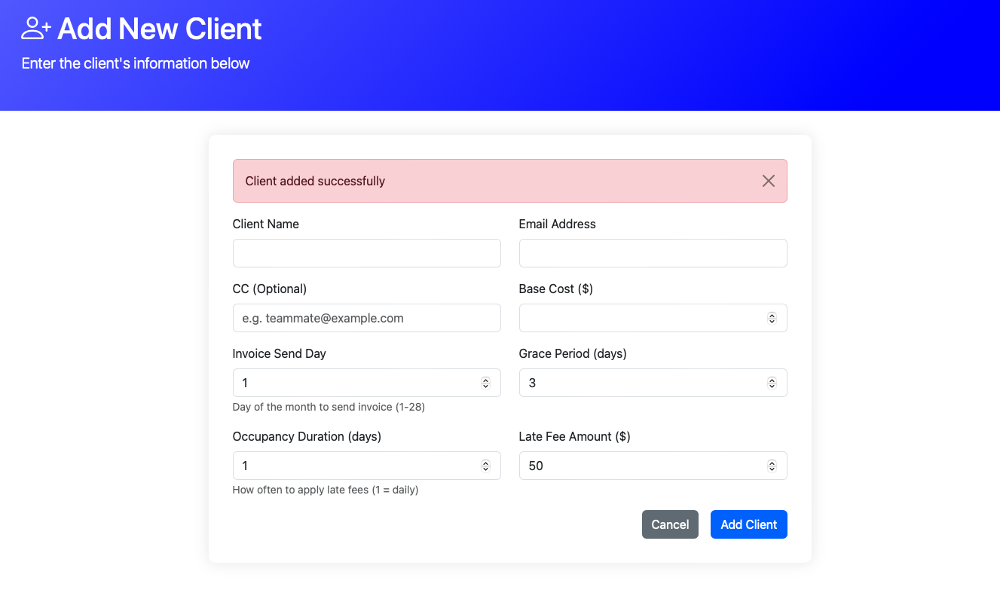

# 📧 Email Invoice Automation with Late Fee Handling

A full-stack web application built with **Flask** for automating invoice emails with customizable late fees, grace periods, and scheduling.  
Ideal for freelancers, consultants, and small teams to automate recurring client billing and improve payment tracking.

---
## 🖥️ Interface Preview

### 🏠 Welcome Page (Before Login)

This is the **landing screen** if you're not logged in:



- Click **Login** to access your dashboard if you're a returning user.
- New users can **Register** and set up their SMTP settings.

---

### 📊 Dashboard (Main Screen After Login)

Once you're logged in, you're directed to the **Invoice Dashboard**:



Here you can:

- View total revenue, pending payments, and late fees
- Add new clients or manage existing ones
- See client status (Paid, Late, etc.)
- Mark invoices as paid/unpaid or edit details

---

## ➕ Adding a New Client

Click the **"Add New Client"** button from the dashboard.

You'll see this form:



Fill in:

- **Client Name & Email**
- **CC (Optional)**: For teammates or stakeholders
- **Base Cost**
- **Send Day**: Day of the month to send invoices
- **Grace Period** & **Late Fee**
- **Occupancy Duration**: Frequency of late fee (e.g., every day)

> 💡 Duplicate emails are prevented. You'll get an error if the email already exists.

---

## 🔄 Managing Clients

From the **Dashboard** or **"View All Clients"** page, you can:

- ✅ Mark invoices as paid/unpaid
- ✏️ Edit client details
- 🗑️ Delete clients (if implemented)
---

## ⚙️ Key Features

- 🧑‍💼 **User Authentication**: Secure login & registration with SMTP email setup
- 👥 **Client Management**: Add/edit/delete clients, track payment status
- ⏰ **Automated Invoices**: Schedule invoices monthly on custom day/hour
- 💸 **Late Fee System**: Custom grace period, frequency, and penalty per client
- 📊 **Dashboard**: View client status, monthly revenue, and invoice history
- 📬 **SMTP Integration**: Compatible with Gmail, Outlook, Yahoo, or custom SMTP
- 🔄 **Recurring Invoicing**: Auto-resets unpaid status monthly
- 🌐 **Responsive Design**: Works well on desktop and mobile devices (Bootstrap 5)

---

## 🗂️ Project Structure

```
email-automation/
├── app.py              # Main Flask app (routes, views, scheduling)
├── main.py             # Handles sending invoice emails
├── models.py           # SQLAlchemy models: User, Client, Revenue
├── init_db.py          # One-time database initializer
├── migrate_csv.py      # Legacy: migrate from CSV to DB
├── templates/          # HTML templates (dashboard, auth, client forms)
├── static/             # CSS/JS assets
├── .env                # Environment variables (SMTP credentials, secrets)
├── requirements.txt    # Python dependencies
└── README.md           # This file
```

---

## 🚀 Getting Started

### ✅ Prerequisites

- Python 3.8+
- pip
- Gmail App Password (or another SMTP-compatible email)

### 🔧 Installation

```bash
git clone https://github.com/yourusername/email-automation.git
cd email-automation

# Set up virtual environment
python -m venv venv
source venv/bin/activate  # On Windows: venv\Scripts\activate

# Install dependencies
pip install -r requirements.txt

# Set up environment variables
cp .env.example .env
# Then update .env with your SMTP config and secret key
```

### 🔄 Database Setup

```bash
flask db init
flask db migrate
flask db upgrade
```

---

## 💡 Usage

### 🔐 Register and Configure SMTP

1. Open the app: [http://127.0.0.1:5000](http://127.0.0.1:5000)
2. Sign up with your email and password
3. Enter SMTP settings:
   - **Gmail**: `smtp.gmail.com` and port `587`
   - Use a **Google App Password** as your SMTP password

---

### ➕ Add Clients

1. Click “Add Client”
2. Fill in:
   - Name and email
   - Monthly fee
   - Invoice send day (1–28)
   - Grace period (in days)
   - Late fee amount
   - Frequency of late fee (e.g., every 1 day)
3. ✅ Emails must be unique per user
4. Clients will be auto-added to monthly scheduler

---

### 📬 Invoice Scheduling

- Invoices are sent automatically based on each client’s configuration
- After the grace period, a late fee is applied on each recurrence (e.g., daily)
- The client’s `is_paid` status resets every month to support recurring billing

---

## 🛠 Developer Testing

To force-run invoices on every minute for testing, change this in `app.py`:

```python
CronTrigger(minute='*')  # For testing only
```

To reset `is_paid` every 1st of the month, APScheduler handles it with:

```python
scheduler.add_job(reset_client_payment_statuses, trigger='cron', day=1, hour=0)
```

---

## 🔐 SMTP Configuration

### Gmail:

1. Enable 2-Step Verification
2. Visit: https://myaccount.google.com/apppasswords
3. Create an App Password for Mail
4. Use it in your SMTP login credentials

### Other Providers:

| Provider     | SMTP Server           | Port |
|--------------|------------------------|------|
| Gmail        | smtp.gmail.com         | 587  |
| Outlook      | smtp.office365.com     | 587  |
| Yahoo        | smtp.mail.yahoo.com    | 587  |
| Custom       | Your custom host       | Varies |

---

## 💻 Dashboard

- Shows all clients for the logged-in user
- Status indicators:
  - ✅ Paid
  - ❌ Unpaid
  - ⚠️ Late (if past grace period)
- View revenue totals and client statuses in real time

---

## 🧪 Testing Cron Jobs

### Manual run:
```bash
python main.py
```

### Add to `crontab` for monthly:
```bash
0 9 1 * * /usr/bin/python3 /path/to/email-automation/main.py
```

---

## 📌 Planned Features

- [x] Dashboard & client overview
- [x] SMTP + App password integration
- [x] Per-client configuration
- [x] Automated invoice email
- [x] Late fee handling logic
- [ ] PDF invoice attachments
- [ ] Stripe/PayPal integrations
- [ ] Client invoice view link
- [ ] Payment reminder emails

---

## 👨‍💻 Author

**Guk Il Kim**  
📧 [kimgukil2@gmail.com](mailto:kimgukil2@gmail.com)

---

## 📄 License

This project is licensed under the MIT License. See the `LICENSE` file for details.

---

## 🙌 Acknowledgments

- [Flask](https://flask.palletsprojects.com/) – Python Web Framework  
- [Bootstrap](https://getbootstrap.com/) – UI Components  
- [APScheduler](https://apscheduler.readthedocs.io/) – Task Scheduling  
- [Font Awesome](https://fontawesome.com/) – Icons

``` 

Let me know if you’d like a `deploy-to-EC2` or `Dockerfile` section next!
